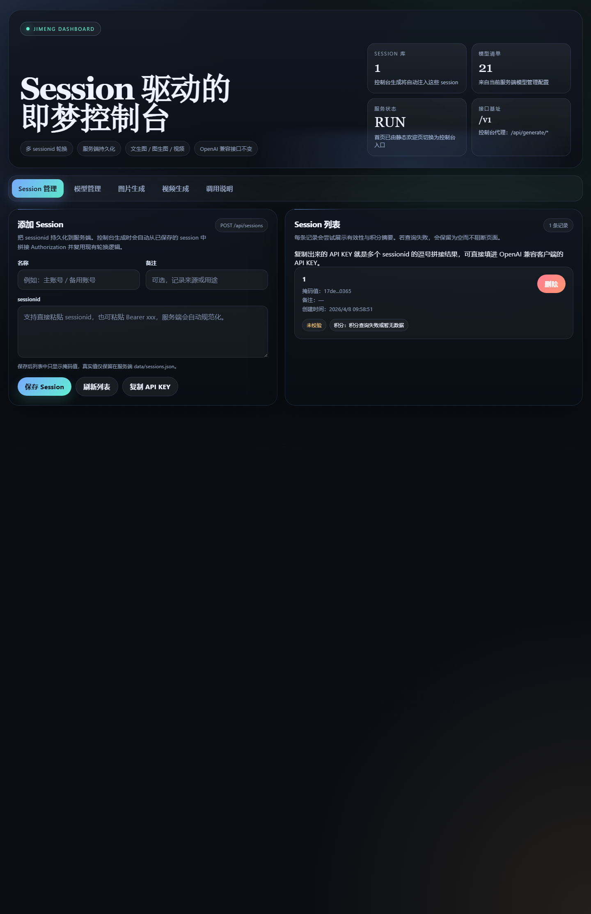
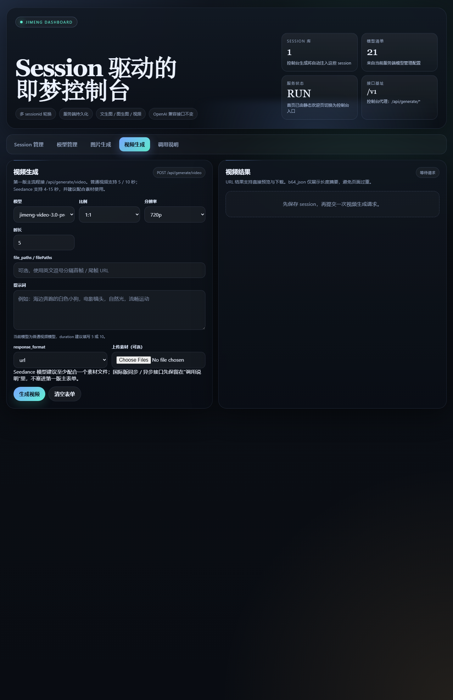

# Jimeng-Router

即梦 AI 免费 API 服务，提供 OpenAI 兼容图片/视频接口，并带一个可直接使用的控制台页面。

重点参考镜像 **`wwwzhouhui569/jimeng-free-api-all`** 


参考镜像名（重点）：`wwwzhouhui569/jimeng-free-api-all`


## 功能概览

- 文生图 / 图生图
- 视频生成
- Session 管理
- 模型管理
- 调用说明示例页
- 控制台代理接口：
  - `POST /api/generate/image`
  - `POST /api/generate/video`
- OpenAI 兼容接口：
  - `GET /v1/models`
  - `POST /v1/images/generations`
  - `POST /v1/videos/generations`

## 运行端口

本项目当前默认对外使用：

- `0.0.0.0:5200:5200`

本地打开：

- `http://127.0.0.1:5200/`
- 健康检查：`http://127.0.0.1:5200/ping`

## 控制台截图

### 控制台首页



### 视频生成页



## 本地直接运行

### 1. 安装依赖

```bash
npm install
```

### 2. 安装 Chromium

```bash
npx playwright-core install chromium
```

### 3. 构建

```bash
npm run build
```

### 4. 启动

```bash
npm start -- --port 5200
```

## Docker 构建运行

### 构建本地镜像

```bash
docker build -t jimeng-router:latest .
```

### 运行容器

```bash
docker run -d \
  --name jimeng-router \
  -p 5200:5200 \
  -e SERVER_HOST=0.0.0.0 \
  -e SERVER_PORT=5200 \
  -e NODE_ENV=production \
  -v $(pwd)/data:/app/data \
  -v $(pwd)/logs:/app/logs \
  -v $(pwd)/tmp:/app/tmp \
  jimeng-router:latest
```

## Docker Compose

仓库已提供 `docker-compose.yml`。

### 启动

```bash
docker compose up -d --build
```

### 停止

```bash
docker compose down
```

### 当前映射

```yaml
ports:
  - "0.0.0.0:5200:5200"
```

## Docker Hub 发布示例

### 推荐镜像名

```text
zhoushu1/jimeng-router
```

### 手动打 tag

```bash
docker tag jimeng-router:latest zhoushu1/jimeng-router:latest
```

### 推送

```bash
docker push zhoushu1/jimeng-router:latest
```

### 拉取运行

```bash
docker pull zhoushu1/jimeng-router:latest

docker run -d \
  --name jimeng-router \
  -p 5200:5200 \
  -e SERVER_HOST=0.0.0.0 \
  -e SERVER_PORT=5200 \
  -v $(pwd)/data:/app/data \
  -v $(pwd)/logs:/app/logs \
  -v $(pwd)/tmp:/app/tmp \
  zhoushu1/jimeng-router:latest
```

## 控制台使用说明

### 1. 打开页面

浏览器访问：

```text
http://127.0.0.1:5200/
```

### 2. 先添加 Session

在 `Session 管理` 页填写：
- 名称
- 备注
- `sessionid`

保存后，控制台会自动把 session 持久化到服务端的 `data/sessions.json`。

### 3. 图片生成

进入 `图片生成` 页：
- 选择模型
- 输入提示词
- 可选填写图片 URL 数组
- 或直接上传图片文件
- 点击“生成图片”

前端会请求：

```text
POST /api/generate/image
```

后端会自动注入已保存的 session。

### 4. 视频生成

进入 `视频生成` 页：
- 选择视频模型
- 输入提示词
- 设置比例、分辨率、时长
- 可选上传素材
- 点击“生成视频”

前端会请求：

```text
POST /api/generate/video
```

### 5. 调用说明

进入 `调用说明` 页，可以直接查看：
- cURL 示例
- Python 示例
- OpenAI 客户端参数示例

当前示例基址已改为：

```text
https://127.0.0.1/v1
```

## OpenAI 兼容调用示例

### 查看模型

```bash
curl http://127.0.0.1:5200/v1/models
```

### 文生图

```bash
curl -X POST http://127.0.0.1:5200/v1/images/generations \
  -H "Content-Type: application/json" \
  -H "Authorization: Bearer your_sessionid" \
  -d '{"model":"jimeng-5.0","prompt":"霓虹雨夜中的未来城市","ratio":"16:9","resolution":"2k"}'
```

### 视频生成

```bash
curl -X POST http://127.0.0.1:5200/v1/videos/generations \
  -H "Content-Type: application/json" \
  -H "Authorization: Bearer your_sessionid" \
  -d '{"model":"jimeng-video-3.5-pro","prompt":"海边奔跑的白色小狗，电影镜头","ratio":"16:9","resolution":"720p","duration":5}'
```

## GitHub Actions 自动构建镜像

仓库已带工作流：

- `.github/workflows/docker-image.yml`

触发条件：
- push 到 `master`
- 手动 `workflow_dispatch`

### 需要配置的 GitHub 仓库密钥

工作流现在会直接构建并推送到 Docker Hub，请先配置：

- `DOCKER_HUB_USERNAME`
- `DOCKER_HUB_TOKEN`

镜像名已经在工作流内固定为：

```text
zhoushu1/jimeng-router
```

### 工作流会做什么

- checkout 代码
- 设置 buildx
- 校验 Docker Hub 配置
- 登录 Docker Hub
- 用根目录 `Dockerfile` 构建镜像
- 推送：
  - `latest`
  - `sha-短提交号`

## 项目目录

```text
.
├─ Dockerfile
├─ docker-compose.yml
├─ .dockerignore
├─ .github/workflows/docker-image.yml
├─ public/welcome.html
├─ src/
├─ data/
├─ logs/
├─ tmp/
└─ doc/
   ├─ console-home.png
   └─ console-video.png
```

## 说明

- 控制台首页由 `GET /` 提供
- 控制台代理路由在 `src/api/routes/dashboard.ts`
- 本次示例地址已统一改为 `https://127.0.0.1`
- 如果本地页面没更新，先确认是否仍在跑旧的 `dist` 进程
